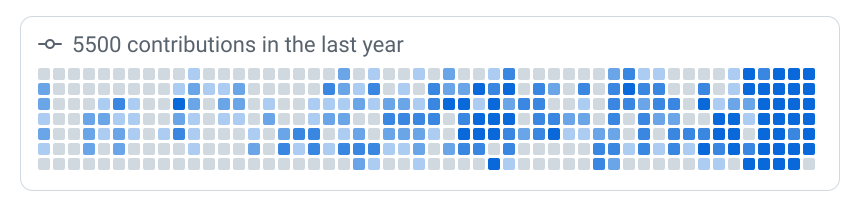
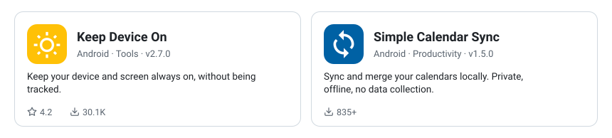

<!-- Generated by gh-profile-scripts (build-profile-readme.py); do not edit by hand. -->

  <picture>
      <source media="(prefers-color-scheme: dark)" srcset="assets/hero-dark.svg">
      
    </picture>

            

          

                                  

  <a href="https://github.com/rperez93?tab=repositories&q=&type=public&language=&sort=">
    <picture>
      <source media="(prefers-color-scheme: dark)" srcset="assets/stats-dark.svg">
      
    </picture>
  </a>

  <a href="https://rperez.me/#statistics">
    <picture>
      <source media="(prefers-color-scheme: dark)" srcset="assets/activity-dark.svg">
      
    </picture>
  </a>

  <a href="https://rperez.me/products/">
    <picture>
      <source media="(prefers-color-scheme: dark)" srcset="assets/products-dark.svg">
      
    </picture>
  </a>

Projects, CV and more at <a href="https://rperez.me">rperez.me</a>. Cards refresh nightly.

